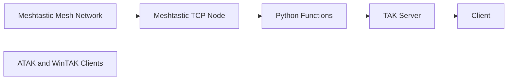

# Meshtak
**Meshtastic → TAK Gateway**

Meshtak is a lightweight Python service that bridges **Meshtastic mesh position data**
to **TAK (Team Awareness Kit)** by converting Meshtastic packets into
**Cursor-on-Target (CoT)** events and forwarding them to a TAK server over UDP.

It runs as a **systemd service** and supports both **APT-based** and **DNF-based**
Linux distributions.

---

## What Meshtak Does

- Connects to a Meshtastic node via TCP
- Subscribes to Meshtastic pubsub events
- Tracks node callsigns and positions
- Rate-limits position updates per node
- Converts positions into CoT XML
- Sends CoT events to a TAK server via UDP

TAK clients (ATAK / WinTAK) then display Meshtastic nodes as live map objects.

---

## Architecture Overview




# How To
1. `cd` to `/opt` and run `git clone https://github.com/maui671/meshtak`
2. Run `cd /opt/meshtak`
3. `chmod +x setup.sh`
4. `nano meshtak.py` or `vi meshtak.py` and edit the following as needed.
    - MESHTASTIC_HOST = "{IP address of IP connected Meshtastic gateway}"
    - TAK_HOST = "{IP address of TAK server that the Meshtastic gateway can connect to}"
5. `./setup.sh`
6. Profit!
7. In TAK Server navigate to ```Configuration```->```Inputs and Data Feeds```
    - Under ```Streaming Data Feeds```, select ```Add Streaming Data Feed```
        - Alter ```Protocol``` to ```Standard UDP (UDP)```
        - For ```Authentication Type``` select ```None```
        - ```Port``` is as desired, the default on this build is ```8087```. If you deviate from this port, you MUST alter that in step 4.
        - All other options are at your discretion but do not need to be altered.
        - Press ```Save```
8. **Profit!**

```mermaid
flowchart LR
    Mesh[Meshtastic Mesh Network]
    Node[Meshtastic TCP Node]
    Gateway[Meshtak Gateway<br/>meshtak.py]
    TAK[TAK Server]
    Clients[ATAK and WinTAK Clients]

    Mesh --> Node
    Node --> Gateway
    Gateway --> TAK
    TAK --> Clients
